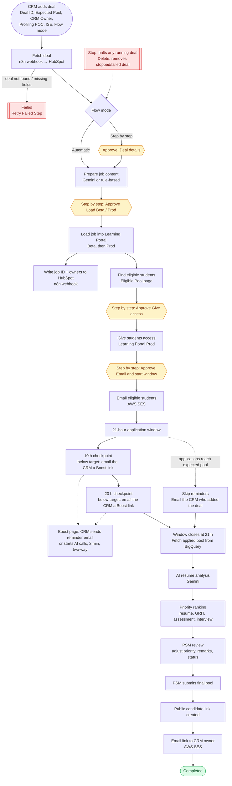

# Job Flow Automation: Requirements and Flow

## 1. Purpose

Automate NIAT internship job loading end to end: from a HubSpot deal to a ranked, PSM-reviewed
candidate pool shared with the company. It replaces the manual CRM_Job_Loading tool.

## 2. Users and roles

| Role | What they do | Screens |
|---|---|---|
| **CRM** | Adds HubSpot deals, approves steps (step-by-step mode), stops or deletes deals | Dashboard, Deals (each deal's page, including its Reminders tab), Interviews, Settings |
| **PSM** | Reviews the AI-ranked candidates, adjusts priorities, submits the final pool | Candidate Pools, Candidate Review, Settings |
| **ADMIN** | Everything above, plus managing users and their HubSpot owners | All screens + Settings → Users |

Sign-in:
- **Google:** the company Google account (needs `GOOGLE_CLIENT_ID`).
- **Email:** for local use only; turned off automatically in production.

Only users in the user list can sign in. Admins add them under **Settings → Users** or with the CLI.
Every user is linked to a **HubSpot owner** (name, owner ID, email).

## 3. End-to-end flow

Yellow boxes are approval stops used only in **Step by step** mode. In **Automatic** mode they pass
straight through.

### Step details

| # | Step | What happens | Uses |
|---|---|---|---|
| 1 | Add deal | CRM enters Deal ID or link, **Expected Pool**, **CRM Owner**, **Profiling POC**, **ISE** (owners preselect the signed-in user's HubSpot owner) and chooses **Automatic** or **Step by step** | App |
| 2 | Fetch deal | `POST {action:"fetch", dealId, properties, companyProperties}` to the deal webhook; reply must be the deal JSON | n8n → HubSpot |
| 3 | Prepare job | Builds the job title, description, eligibility and disclaimer (AI, or a rule-based fallback) | Gemini (optional) |
| 4 | Load job | Creates the organisation if needed and the job in **Beta**, then **Prod**, with `job_extra_details.crm / profiling_poc / ise` | Learning Portal API |
| 5 | Write back | `POST {action:"update", dealId, properties:{job_id}}`, then `{crm, profiling_poc, ise}` owner IDs | n8n → HubSpot |
| 6 | Eligible students | Students marked **Eligible** on the Eligible Pool page for the deal's products (NIAT, Academy, …) and pass-out year, with their email and mobile | MongoDB (Eligible Pool) |
| 7 | Give access | Grants the job to eligible students in Prod; the Learning Portal emails them about the job | Learning Portal API |
| 8 | Start window | Opens the application window and schedules the checkpoints and the close (no email from the app) | App |
| 9 | Window | 21 h. At 10 h and 20 h, if applications are below the expected pool, the CRM gets an email with a **Boost applications** link. There the CRM sends a reminder email or starts AI calls (agent built from the JD, `{name}` and `{jd}` per call, two-way, up to 2 minutes). Call status, answers and ratings come back automatically | SES, NxtDial |
| 10 | Pool reached | When applications ≥ expected pool: reminders skipped, **one email to the CRM who added the deal** | SES |
| 11 | Close + fetch | At 21 h the applied pool is read | BigQuery |
| 12 | AI analysis | Each resume scored against the job | Gemini |
| 13 | Priority | Weighted ranking (resume 40, GRIT 25, assessment 20, interview 15) | App |
| 14 | PSM review | PSM changes priorities, remarks and candidate status, then submits | App |
| 15 | Share | Shared profiles link `/shared/profiles/<job ID>` (editable sheet, expires in 30 days) emailed to the CRM who loaded the deal | SES |

### Flow modes

- **Automatic:** every step runs by itself.
- **Step by step:** the deal waits for CRM approval before each of these steps: Deal details, Load Beta,
  Load Prod, Give students access, Start application window. Course plans can be edited at
  the first load approval.

### Deal controls

- **Retry Failed Step:** re-runs a failed step.
- **Stop:** halts a running deal; nothing more runs.
- **Delete:** removes a stopped or failed deal and all its data, so the Deal ID can be submitted again.
- Finished deals cannot be stopped or deleted.

## 4. Data rules

- **Required on every deal:** company, job role, expected pool, CRM owner.
- **Expected pool** is entered in the app and stored only in the app's database. HubSpot never sets it.
- **HubSpot** is read and written **only through the n8n deal webhook**. No HubSpot token is used.
- **HubSpot owners** (name, ID, email) come from the owner map taken from CRM_Job_Loading. It is kept
  only in `apps/api/.env` (`HUBSPOT_OWNER_MAP_JSON`) or a git-ignored local file, never in GitHub.
- **Student PII** (name, email, phone, resume, education) is used only inside this workflow.
  Candidate details are visible to PSM/ADMIN only. Company links show the shortlisted candidates.

## 5. Integrations and settings (`apps/api/.env`)

| Integration | Used for | Settings | Status |
|---|---|---|---|
| MongoDB Atlas | All app data and the task queue | `MONGODB_URI` | ✅ Set |
| HubSpot (n8n webhook) | Read deal, write job ID and owners | `HUBSPOT_DEAL_WEBHOOK_URL` | ✅ Set. n8n must reply to `fetch` with the deal and handle `update` |
| Learning Portal | Organisation, job, eligibility, access | `BETA_API_KEY`, `PROD_API_KEY`, `LEARNING_PORTAL_BETA_BASE_URL`, `LEARNING_PORTAL_PROD_BASE_URL` | ✅ Set |
| Google sign-in | Company login | `GOOGLE_CLIENT_ID` | ⏳ Pending |
| Gemini | Job content, resume analysis | `GEMINI_API_KEY` | ⏳ Pending |
| BigQuery | Student details, applied pool, scores | `GOOGLE_APPLICATION_CREDENTIALS_JSON` (table names in `config/bigqueryTables.js`) | ⏳ Pending (HoD approval for PII) |
| AWS SES | All emails | `SES_FROM_EMAIL`, `AWS_ACCESS_KEY_ID`, `AWS_SECRET_ACCESS_KEY` | ⏳ Pending |
| NxtDial | AI calls from the Boost page | `NXTDIAL_BASE_URL`, `NXTDIAL_API_KEY`, `NXTDIAL_FROM_NUMBER` (`NXTDIAL_AGENT_ID` optional) | ⏳ Pending |

Missing settings never stop the app. It starts, lists what is missing, and only the step that needs a
missing key fails with a clear message. Add the key, restart the API, then press **Retry Failed Step**.

## 6. Tech and deployment

- **Backend:** Node.js, Express, MongoDB (Mongoose). The background worker runs the steps from a
  persisted task queue, with retries and backoff.
- **Frontend:** React, Vite, Tailwind CSS.
- **Hosting (planned):** API and worker on Northflank, frontend on Vercel, MongoDB Atlas.
- **Local run:** `npm run dev:api` then `npm run dev:web`, and open http://localhost:5173.

## 7. Open items

1. n8n deal webhook: return the deal JSON for `action: "fetch"` (it currently returns an empty reply)
   and apply `action: "update"`.
2. Business HoD approval for BigQuery student PII, then the BigQuery credentials.
3. Google OAuth client (Client ID).
4. Gemini, AWS SES and NxtDial credentials.
5. Deployment to Northflank and Vercel. After that, stop the local worker so it doesn't process real tasks.
